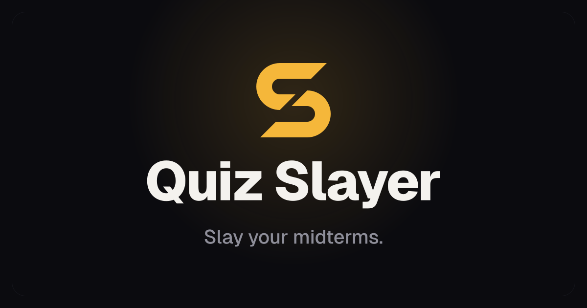
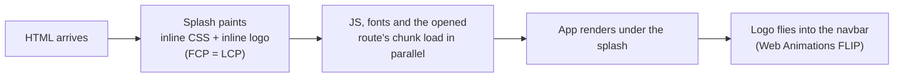

<div align="center">



# Quiz Slayer

**Fast, offline-first MCQ practice for university exams.**
Short rounds, instant feedback, mistake retries, streaks and a live leaderboard. Installable, and it works on a train with no signal.

[**Open the app →**](https://quiz.zubyr.dev)


<br />


</div>

---

## Features

- **Practice that sticks.** Quick 10-question rounds or full sets, with an explanation after every answer. **Retry mistakes** replays only the questions you got wrong.
- **Mock exams.** A timed exam mode that leaves out questions you have already mastered.
- **Keyboard first.** Answer, move and submit without touching the mouse (shortcuts below).
- **Leaderboard with negative marking.** Points = first-time correct − wrong ÷ (options − 1), so guessing doesn't pay. The server grades every attempt against answer keys it holds, and the top three get a podium.
- **No accounts.** Pick a name once, or keep the generated one (*Daring Falcon 76*). Your identity is a random secret on your device.
- **Two devices, one player.** Link your phone and laptop with a QR code and a 6-digit code.
- **Offline first.** Quizzes, history, streaks and XP all live on the device. Attempts made offline queue up and sync when you're back.
- **Bring your own subject.** Upload a JSON file, or paste your notes into any AI chat using the built-in prompt and upload what it gives you.
- **Feels premium on cheap phones.** A cinematic intro, view transitions and 3D icons, plus a **lite mode** that switches itself on for low-end devices, Data Saver or reduced motion.
- **Share card.** Turn a result into an image for your group chat.

### Keyboard shortcuts

| Key | Action |
| --- | --- |
| <kbd>1</kbd>–<kbd>5</kbd> | Pick an option |
| <kbd>Enter</kbd> | Next question |
| <kbd>Backspace</kbd> | Previous question |
| <kbd>E</kbd> | Full explanation |
| <kbd>?</kbd> | All shortcuts |

## Performance

Lab scores from Lighthouse 13 on the production build (simulated slow 4G and a mid-range phone for mobile):

| | Performance | FCP | LCP | TBT | CLS |
| --- | --- | --- | --- | --- | --- |
| Mobile | **97–100** | 1.1 s | 1.6 s | ≤ 80 ms | 0 |
| Desktop | **100** | 0.3 s | 0.4 s | 0 ms | 0.004 |

How it gets there:



- **The HTML alone paints the first screen.** The stylesheet is inlined, and a 160px copy of the logo is embedded at build time, so the splash shows with the first bytes and no request can hold it back.
- **Paint first, then load.** JS and fonts are requested the moment the splash is on screen. The splash stays up only until the app has rendered, so you never see a blank or half-styled page.
- **Route-aware preloading.** Whichever URL you open, its page chunk downloads alongside the main bundle, not after it.
- **Lean main bundle.** Vendor code (React, Convex) sits in its own long-cached chunks. Smooth scrolling and device linking load on demand, and touch-only phones never download the smooth-scroll library at all.
- **No layout shift.** History is read from IndexedDB in the route loader, so the first render already has your data.
- **Caching.** Hashed assets are `immutable` for a year. A service worker precaches the whole app shell (~1 MB) after the first visit, and icons and avatars are cached the first time they appear.

All of this lives in [`vite/perfHints.ts`](vite/perfHints.ts), the splash in [`index.html`](index.html) and the handoff animation in [`src/lib/splash.ts`](src/lib/splash.ts).

## Getting started

Requires **Node.js 20.19+** (or 22.12+).

```bash
git clone https://github.com/zubairbinshaukat/quiz-slayer.git
cd quiz-slayer
npm install
npm run dev
```

That's it. Without a backend the app runs fully local: quizzes, history, mistakes, streaks and custom subjects all work. Only the global leaderboard, device linking and visit counting are switched off.

### With the Convex backend

1. Copy `.env.example` to `.env.local` and set `VITE_CONVEX_URL` (create a deployment with `npx convex dev`).
2. Run `npx convex dev --once` after any change in `convex/`.
3. In the Convex dashboard (Settings → Environment Variables), set:
   - `BANKS_ADMIN_KEY`: any long random string. Put the same value in `.env.local`, then run `npm run banks:push` to upload the answer keys. Re-run it whenever a subject in `src/data` changes.
   - `ADMIN_PIN` (optional, 6 digits): unlocks the owner's hidden stats page.

### Scripts

| Command | What it does |
| --- | --- |
| `npm run dev` | Dev server with hot reload |
| `npm run build` | Type-check and production build (`dist/`) |
| `npm run preview` | Serve the production build locally |
| `npm run typecheck` | Type-check the app, config and scripts |
| `npm run lint` | ESLint |
| `npm run banks:push` | Upload built-in answer keys to Convex |
| `npm run icons` | Regenerate favicons and PWA icons from `branding/` |
| `npm run emoji:fetch` | Fetch the 3D emoji avatars |

## Adding a subject

Built-in subjects are JSON files in [`src/data`](src/data). Anyone can also upload one from the **Add subject** page, where it is stored on their device only:

```json
{
  "subject": "Machine Learning",
  "slug": "machine-learning",
  "questions": [
    {
      "id": 1,
      "text": "What is supervised learning?",
      "options": ["Learning from labeled input-output pairs", "Clustering unlabeled data", "Learning by trial and error", "Compressing features"],
      "correctIndex": 0,
      "shortExplanation": "Supervised learning trains on labeled input-output pairs.",
      "explanation": "Each training input has a known output, so the model learns the mapping between them."
    }
  ]
}
```

`slug` uses lowercase letters, digits and dashes. Each question needs at least two options. Uploaded subjects are practice only: they are never ranked on the leaderboard.

## Project structure

```text
src/
  pages/          route screens (lazy-loaded per route)
  components/     UI by feature: quiz, dashboard, leaderboard, devices, layout, ui
  hooks/          React hooks (quiz flow, history, leaderboard, keyboard)
  context/        quiz, theme, sound and lite-mode providers
  lib/            storage, scoring, streaks, splash, sync outbox, helpers
  data/           built-in question banks
convex/           backend: players, attempts, leaderboard, device linking, stats
vite/             build plugin for the first-load pipeline
scripts/          icon generation, emoji fetch, answer-key upload
branding/         logo sources
```

## Privacy

- **No accounts and no personal data.** The leaderboard knows you by a random secret on your device.
- **Anonymous visit counts only.** Once per session the app sends coarse categories (mobile, tablet or desktop; OS and browser family; installed or not) and a truncated hash of a random device id, used only to count unique visitors per day and deleted after 30 days. No IP address, location or user-agent string is stored.
- **Device linking is optional** and limited to two devices. It never merges or moves points.

## Deploying

The app is a static site and runs on any static host. [`vercel.json`](vercel.json) sets up the SPA rewrite and cache headers on Vercel. With Convex, use `npx convex deploy --cmd "npm run build"` as the build command and add `CONVEX_DEPLOY_KEY` to the project's environment variables.

## Credits

- 3D icons by [3dicons.co](https://3dicons.co) (CC0)
- Avatars from [Fluent Emoji](https://github.com/microsoft/fluentui-emoji) by Microsoft (MIT)
- Fonts: [Geist](https://vercel.com/font) and [Bricolage Grotesque](https://fonts.google.com/specimen/Bricolage+Grotesque), self-hosted

---

<div align="center">

Designed and built by [**Zubair Bin Shaukat**](https://zubyr.dev)

</div>
